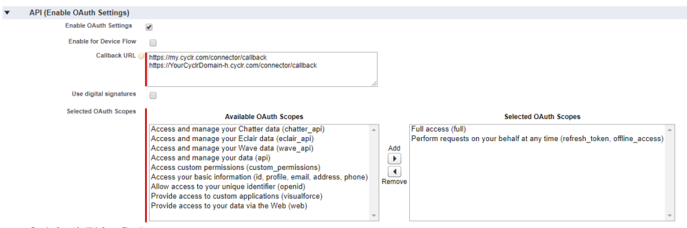

# Salesforce #

Partner Setup
-------------

Salesforce uses OAuth 2 for remote API access. You must register Cyclr within Salesforce as your own Connected App to receive OAuth Client ID and Client Secret values to enable Cyclr to authenticate with Salesforce.

The official Salesforce documentation for creating a **Connected App** can be found [here](https://help.salesforce.com/articleView?id=connected_app_create.htm).

**Salesforce set up – Register Your Application**
-------------------------------------------------

### **Introduction**

You can register for a free Salesforce developer account or log into your existing Salesforce account if you have one.  You can use any Salesforce account to create a Connected App. It doesn’t have to be a developer account.

### **Create your App within Salesforce:**

The steps below are for Salesforce Classic. Settings are similar for Lightning Experience.

*   Log into the Salesforce account
*   click **Setup** in the top right
*   from the side menu down the left, under the **Build** heading click **Create**
*   choose **Apps**
*   from the **Connected Apps** table click the **New** button

When the **New Connected App** screen is shown, complete the form as follows:

#### **Basic Information**

**Connected App Name:** enter a name for your application

**API Name:** this will default to the same value as your Connected App Name

**Contact Email:** your email address

#### **API (Enable OAuth Settings)**

Tick the **Enable OAuth Settings** box to display further options.

**Callback URL**: you must add 2 callback URLs to allow Salesforce to be used in your Cyclr Console templates as well as your Cyclr accounts.

These URLs are:

*   https://my.cyclr.com/connector/callback
*   https://\[Your Cyclr Domain e.g. app-h.cyclr.com\]/connector/callback

**Selected OAuth Scopes**: you must add the following 2 Scopes to enable Cyclr to use your App:

*   Full access (full)
*   Perform requests on your behalf at any time (refresh\_token, offline\_access)

The OAuth settings should look like this:

After saving your App, make a note of your **Consumer Key** and **Consumer Secret** values as you’ll need to enter these into Cyclr.

**Cyclr Set up**
----------------

Set up your Salesforce App within Cyclr:

*   go to your **Cyclr Console**
*   click the **Connectors** menu along the top
*   choose Connector Library
*   scroll down to **Salesforce**
*   click the **Setup** button

Enter the following values:

**Client ID**:  the _Consumer Key_ of your Salesforce Connected App

**Client Secret**: the _Consumer Secret_ of your Salesforce Connected App

Your Salesforce Connector is now set up! You can test it by installing it in one of your Cyclr accounts and executing one of the methods to confirm it can return some data.

**FAQ**
-------

### Expired access/refresh token errors

Salesforce only allows up to five unique access/refresh token pairs to be issued for each user in a Connected App. Older tokens will be automatically revoked by Salesforce.  [More information](https://help.salesforce.com/articleView?id=remoteaccess_request_manage.htm).
