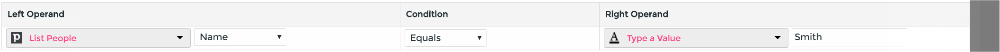

# Decision Steps #

Decision steps can split the data in your cycle down a true or false branch.

Setting up a Decision step
--------------------------

Your cycle must contain at least one Get (green) or Webhook (grey) step.

Click-drag a Decision into your cycle and connect it where you wish to split the data, then click the cog setup button.

Decisions work by comparing a Left Operand to a Right Operand; in other words, it looks for a value in your data and compares it to a condition you specify.

*   First, choose a preceeding step and a field; this is your Left Operand.
*   Second, choose a Condition: _Exists, Not Exists, Equals, Not Equals, Greater Than, Less Than, Contains, Not Contains, In, Not In_.
*   Last, choose your Right Operand. This can the value of a previous step field or you can type in a value.

The result of the screenshot example will route contacts with the last name of “Smith” down the true branch; all other contacts with go down the false branch.

Advanced Decisions
------------------

To create more advanced logic, you can chain multiple decision steps.