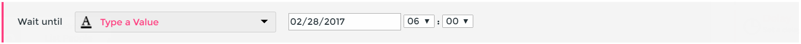

# Wait Until Steps #

You can use a Wait Until step in two ways.

#### Wait for a specific date

For example, the date of an event or webinar you are running.

Select the Type a Value option and choose a date/time using the calendar and dropdown combos.

#### Wait until dynamic date in your data

For example, a contact’s subscription renewal date.

Select a step from the first dropdown, then a field from the second. The field should be a date.