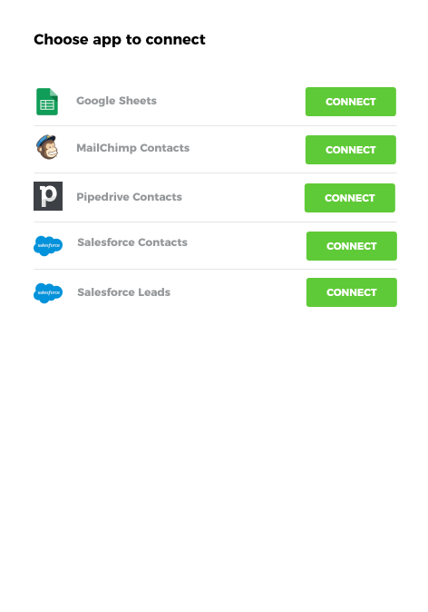
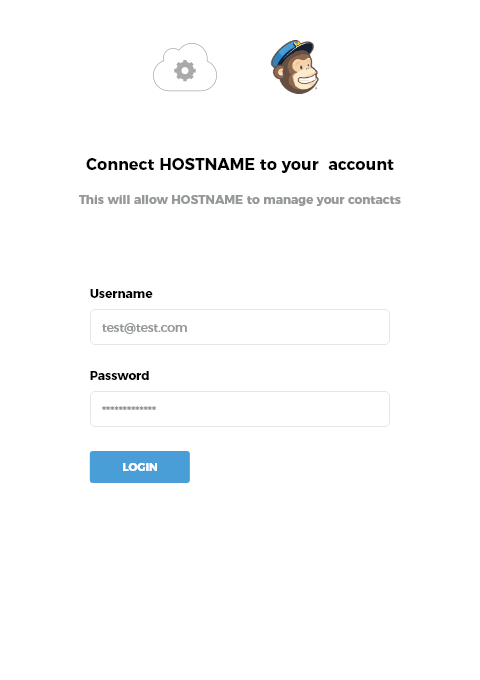
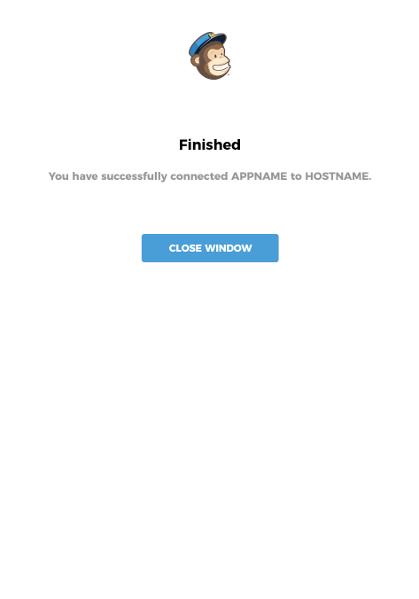

Launch guides your users through setting up an integration between your app and third party apps, requiring them to provide only that information which cannot be included within your integration template.

For example, the process of exporting contacts from your app to your user’s email marketing platform could largely be templated, but it may be desirable to allow your user to select the mailing list that contacts are added to.

Indicate intent to integrate with a 3rd party app
-------------------------------------------------

Your user is presented with the option to install an integration. This could be as simple as an intuitively labelled “Connect” button or link within your app:

Select integration to install
-----------------------------

Upon clicking the button or link within your app, a browser popup opens. Your user is presented with a list of valid integrations that could be installed.

  

 

This screen is bypassed in the event that a single integration template matches the intent indicated by the end user.

Authenticate third party connectors
-----------------------------------

The user is stepped through authenticating each third party connector used within the selected integration template, where that third party connector.

For connectors using OAuth:

  

  
For connectors requiring an API key:

  

  
For connectors requiring a username and password:

  

  
For third party connectors that have previously been authenticated by the same user – e.g. during the installation of other integration templates – the user will not be asked to re-authenticate.

Step setup
----------

For each step within the selected integration template that requires parameters to be selected, the user will be presented with a screen.

  

  
Sometimes, your user will be asked to select from a list of values obtained from within an authenticated connector involved in the template – for example, a list of “Mailing Lists” from within their email marketing platform.

Other times, your user will be asked to select from a predetermined list of valid values – for example an email contacts status, “Subscribed” or “Unsubscribed”.

Finally, there may be occasions where your user needs to provide free-form text for complete flexibility. The source of an email lead, for example.

Return to host app
------------------

Upon completing the setup of their integration, your user will be presented with a customizable screen:

  

  
This screen can be completely customised to include your own HTML and JavaScript.

They will most likely then be returned to your application:

  

  
We provide response values that enable you to update your UI to indicate success, or instigate a backend process to make use of the newly installed Cyclr (for example, start a data export process).

[Building Integration Templates for LAUNCH](./building-integration-templates-launch)