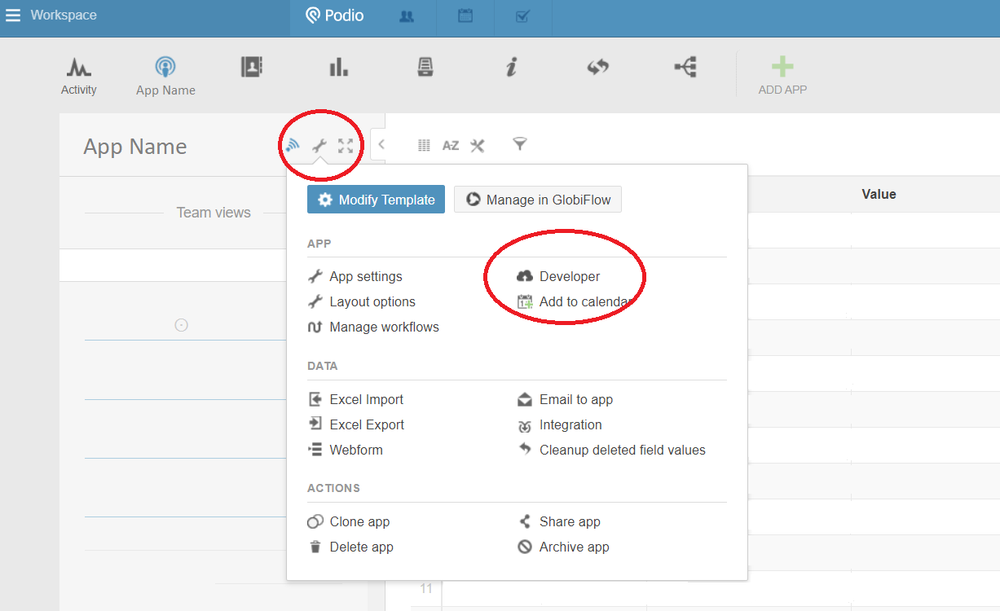

## Authentication

### Podio Interface

To authenticate the connector you will need a **Client ID** and **Client Secret** for the Podio App you wish to interact with.

To generate these values, follow [this link](https://podio.com/settings/api) and then under 'API Key Generator':

1. Enter the name of the application you wish to interact with
2. Enter a return URL (redirect URL)

   > The redirect URL should be https://{service domain}/connector/callback. Your service domain can be found in your Cyclr console under Settings > Integration Settings > Service Domain.

3. Click 'Generate API Key'

### Cyclr Interface

1. Locate the Podio connector in the Cyclr console

   > Cyclr Console > Connectors > Connector Library > Podio

2. Click the open padlock and on the next page enter the **Client ID** and **Client Secret**.

The connector is now authenticated and ready to use.

> It may be the case that you require access to multiple Apps within one Podio account. Our tests have shown that authenticating the connector with one Client ID and Client Secret should give full functionality to the connector across all methods.

## User Guide

### Obtaining the App ID

The connector includes a method 'List Apps' which you can use to find the ID of the App you wish to interact with. If the App in question is not listed, you can find the ID manually in the following way:

1. Locate the App in the Podio interface
2. Click the wrench button at the top right of the sidebar
3. Select 'Developer'

   

4. 'App ID for (App Name)' will be listed on the next page

### Rate-Limits

For most of the actions included in this connector Podio imposes a rate limit of 250 calls per hour. As a result calls (including each page request) are staggered at 15 second intervals.

The maximum page size supported by Podio is 500 objects. If the response to your request contains less than 500 objects you should not experience any delay.
